# Mekanism Factory Information

## TL;DR
<table>
  <thead><tr><th>Situation</th><th>without this mod</th><th>with this mod</th></tr></thead>
  <tbody>
    <tr>
      <th>AE2 Terminal</th>
      <td>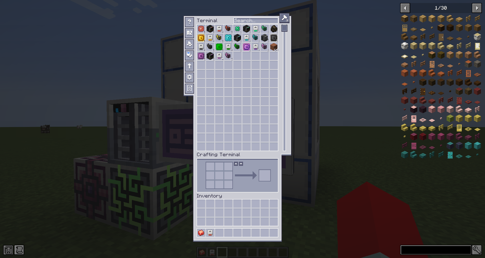</td>
      <td>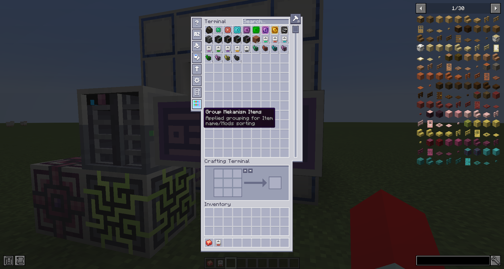</td>
    </tr>
    <tr>
      <th>Item tooltip</th>
      <td>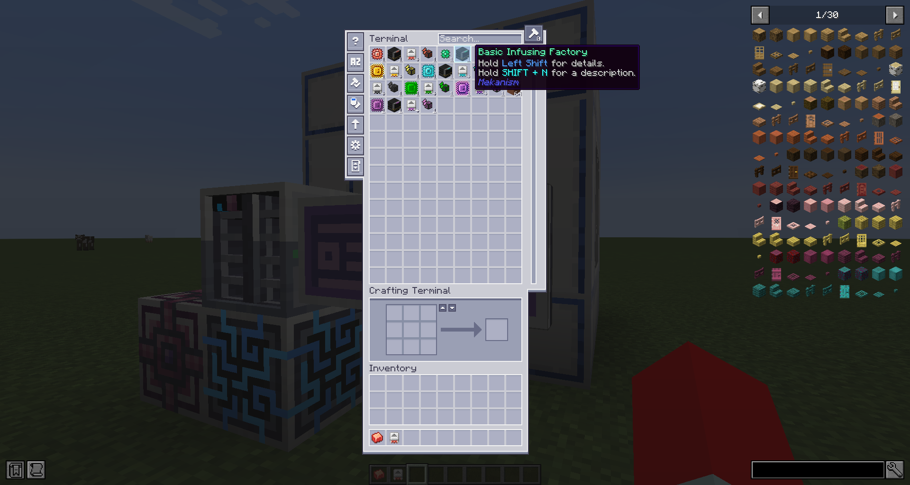</td>
      <td>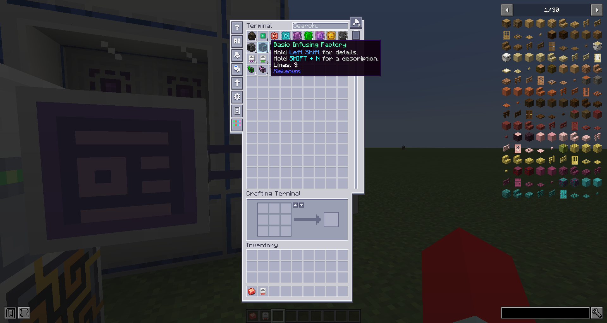</td>
    </tr>
    <tr>
      <th>Jade machine info</th>
      <td>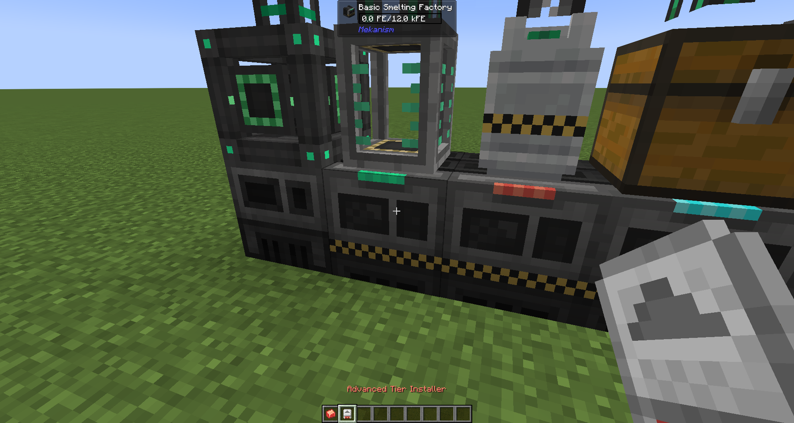</td>
      <td>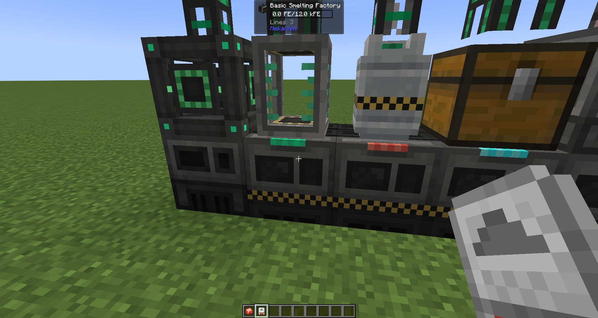</td>
    </tr>
    <tr>
      <th>Jade machine info Sneaking with Installer</th>
      <td>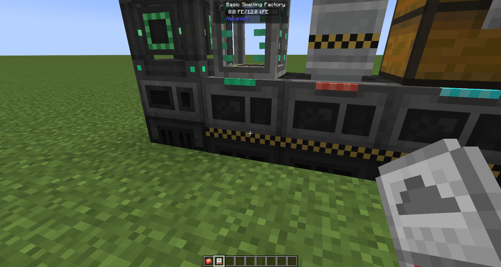</td>
      <td>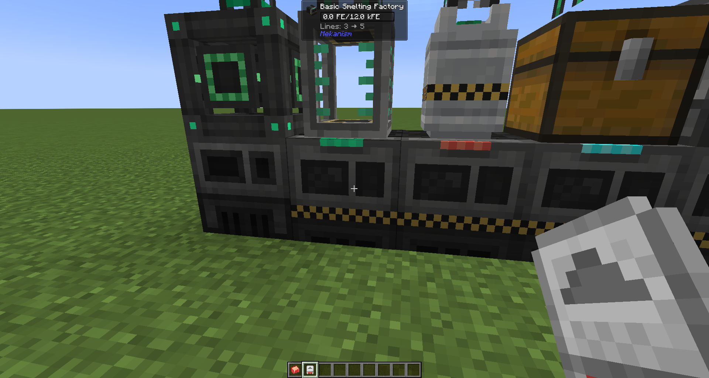</td>
    </tr>
    <tr>
      <th>Jade tank info</th>
      <td>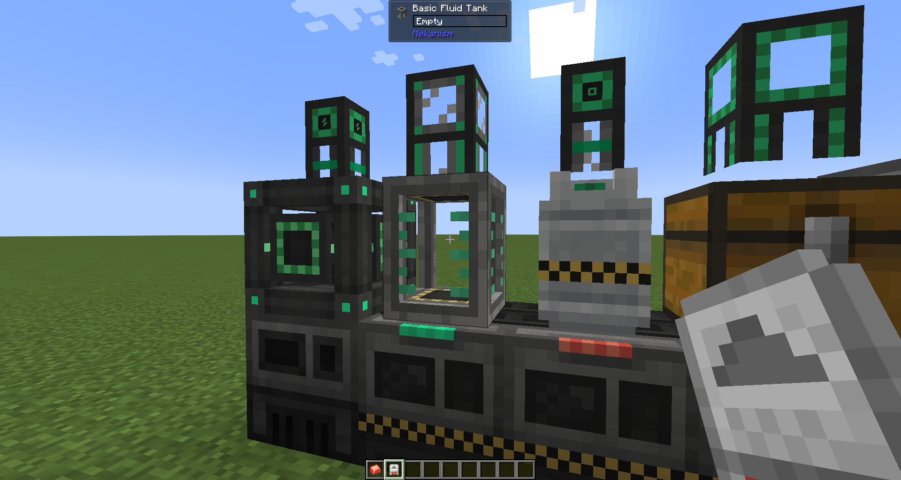</td>
      <td>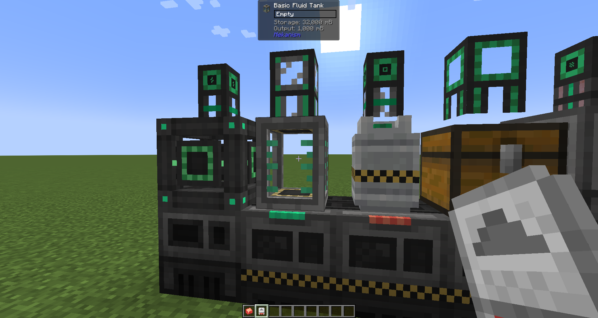</td>
    </tr>
    <tr>
      <th>Jade tank info Sneaking with Installer</th>
      <td>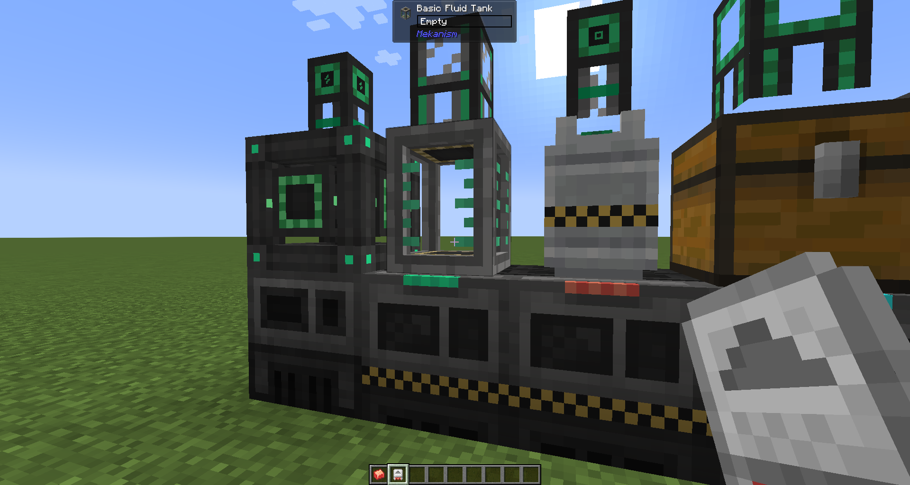</td>
      <td>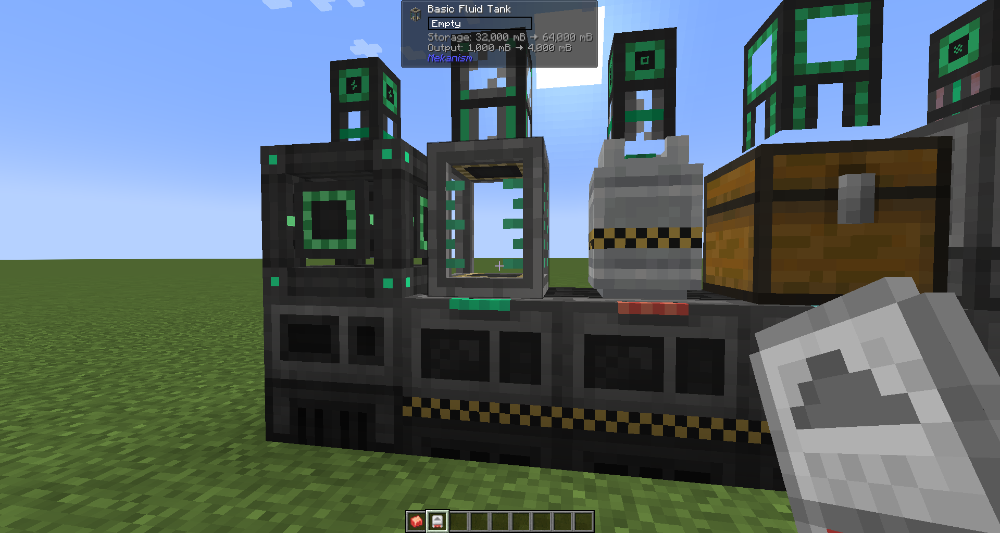</td>
    </tr>
    <tr>
      <th>Jade pipe info</th>
      <td>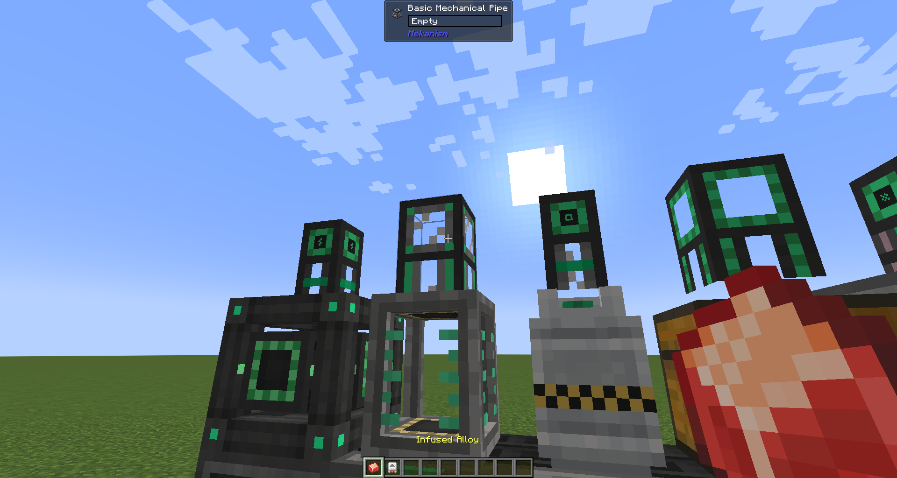</td>
      <td>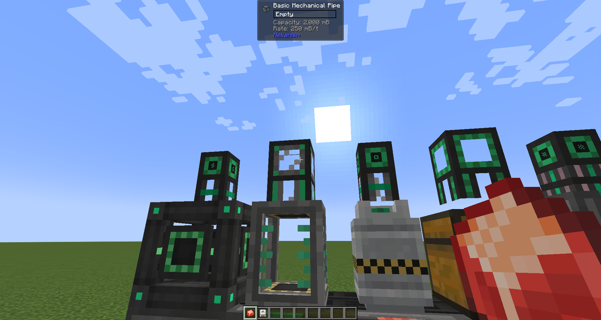</td>
    </tr>
    <tr>
      <th>Jade pipe info Sneaking with Alloy</th>
      <td>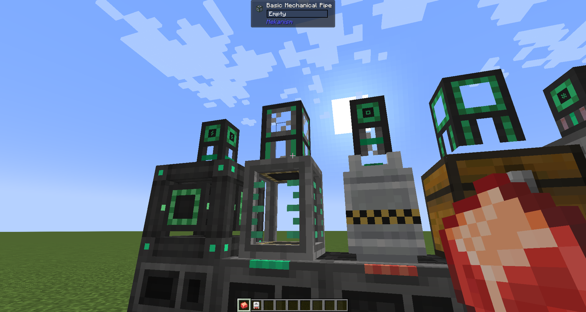</td>
      <td>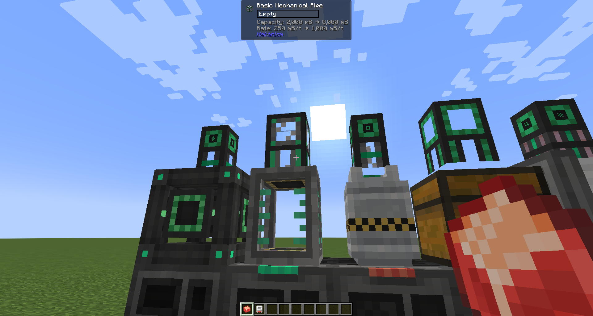</td>
    </tr>
  </tbody>
</table>

## Dependencies
### Required
- [Mekanism](https://www.curseforge.com/minecraft/mc-mods/mekanism)
### Optional
- [Applied Energistics 2](https://www.curseforge.com/minecraft/mc-mods/applied-energistics-2)
- [Jade 🔍](https://www.curseforge.com/minecraft/mc-mods/jade)

## Features

### Item tooltip
Mekanism Factory blocks and Tier Installer items show **Lines: N** in their inventory tooltip, so you can tell at a glance how many processing lines a machine has without placing it.

### AE2 terminal — Lines grouping *(requires Applied Energistics 2)*
A toggle button appears in the ME Terminal toolbar. When enabled, Factory blocks and Tier Installers are grouped and sorted by their Lines count, making it easy to find the tier you want in a large storage system. The setting persists across sessions.

### Jade HUD *(requires Jade)*
Looking at a Mekanism block shows additional information in the Jade HUD:

| Block type | What is shown |
| --- | --- |
| Factory | Lines count |
| Fluid / Chemical Tank, Energy Cube | Storage capacity and output rate |
| Universal Cable, Mechanical Pipe, Pressurized Tube | Transfer capacity and rate |
| Logistical Transporter | Speed (m/s) and pull rate (/s) |

**Upgrade preview:** While sneaking and holding a Tier Installer (for Factories / Tanks / Energy Cubes) or an Alloy (for Cables / Pipes / Tubes / Transporters), the HUD shows the current value alongside what it would become after the upgrade.

## Supported targets
| Module         | Mod Loader | Minecraft |
| -------------- | ---------- | --------- |
| `neoforge`     | NeoForge   | 1.21.1    |
| `forge`        | Forge      | 1.20.1    |

## License

Licensed under the GNU Lesser General Public License v3.0 (LGPL-3.0), the
same license used by Mekanism and Applied Energistics 2. See [LICENSE](LICENSE).
